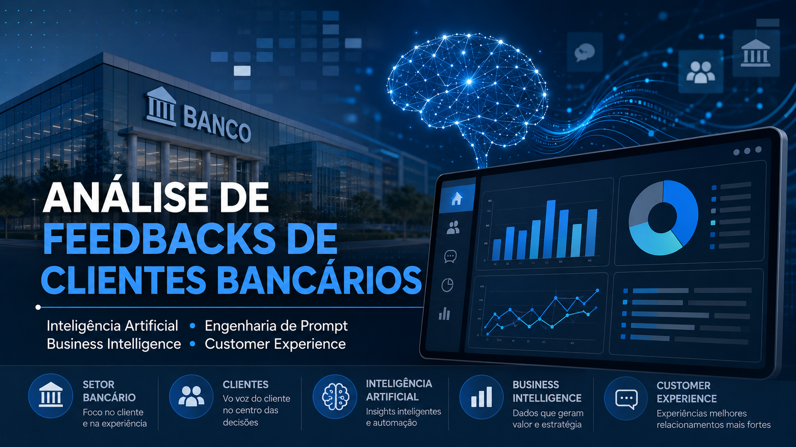
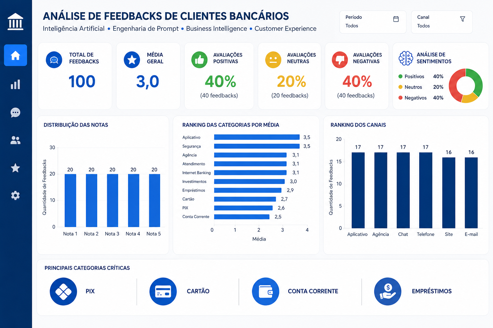
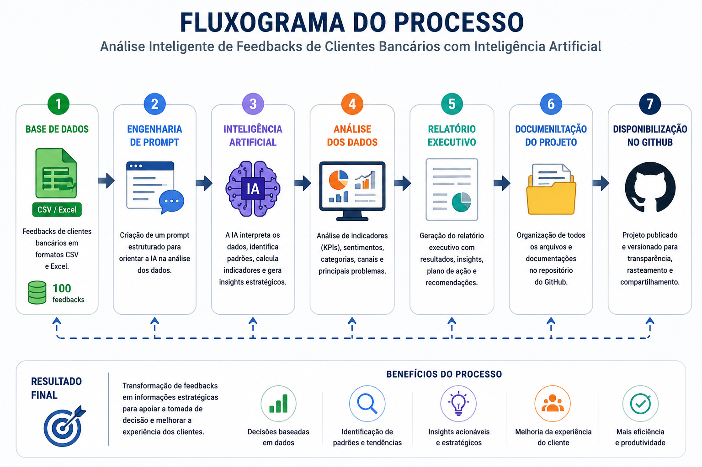

# 🏦 Análise Inteligente de Feedbacks de Clientes Bancários com Inteligência Artificial

<p align="center">



</p>

<p align="center">


</p>

---

# 📖 Sobre o Projeto

Este projeto foi desenvolvido como parte de um desafio prático da **Digital Innovation One (DIO)**.

O objetivo é demonstrar como a **Inteligência Artificial Generativa**, aliada à **Engenharia de Prompt**, pode ser utilizada para transformar uma base de dados contendo feedbacks de clientes bancários em informações estratégicas para apoiar a tomada de decisão.

Durante o desenvolvimento foram aplicados conceitos de:

- Inteligência Artificial Generativa
- Engenharia de Prompt
- Business Intelligence (BI)
- Customer Experience (CX)
- Análise de Dados
- Documentação Técnica
- GitHub

Todo o projeto foi estruturado para simular um cenário corporativo de análise de dados.

---

# 📑 Índice

- [Objetivos](#-objetivos)
- [Tecnologias](#-tecnologias-utilizadas)
- [Estrutura do Projeto](#-estrutura-do-projeto)
- [Demonstração](#-demonstração)
- [Base de Dados](#-base-de-dados)
- [Engenharia de Prompt](#-engenharia-de-prompt)
- [Metodologia](#-metodologia)
- [Resultados](#-resultados-obtidos)
- [Competências](#-competências-desenvolvidas)
- [Aprendizados](#-aprendizados)
- [Autor](#-autor)

---

# 🎯 Objetivos

Este projeto possui os seguintes objetivos:

- Aplicar Inteligência Artificial na análise de dados.
- Desenvolver um processo estruturado de Engenharia de Prompt.
- Interpretar feedbacks de clientes bancários.
- Identificar padrões de satisfação.
- Calcular indicadores de desempenho (KPIs).
- Gerar insights estratégicos.
- Produzir um relatório executivo.
- Organizar toda a documentação em um repositório GitHub.

---

# 🛠️ Tecnologias Utilizadas

| Tecnologia | Aplicação |
|------------|-----------|
| ChatGPT | Inteligência Artificial Generativa |
| Engenharia de Prompt | Construção das instruções para IA |
| Microsoft Excel | Organização da base de dados |
| CSV | Base de dados |
| Git | Versionamento |
| GitHub | Portfólio e documentação |
| Markdown | Documentação |

---

# 📂 Estrutura do Projeto

```
analise-feedbacks-clientes-bancarios-ia/
│
├── README.md
├── LICENSE
│
├── 📁 dados
│
├── 📁 docs
│
├── 📁 imagens
│
├── 📁 prompts
│
└── 📁 relatorios
```

### Organização dos Arquivos

| Pasta | Descrição |
|--------|-----------|
| 📁 [dados](dados/) | Base de dados utilizada durante a análise |
| 📁 [docs](docs/) | Metodologia, arquitetura e aprendizados |
| 📁 [imagens](imagens/) | Imagens utilizadas no projeto |
| 📁 [prompts](prompts/) | Prompt desenvolvido para IA |
| 📁 [relatorios](relatorios/) | Relatório Executivo |

---

# 📸 Demonstração

## 🏦 Capa do Projeto


---

## 📊 Dashboard Executivo



---

## 🔄 Fluxograma do Processo



---

# 📊 Base de Dados

A base utilizada neste projeto contém **100 feedbacks de clientes bancários**, disponibilizados nos formatos CSV e Excel.

Cada registro apresenta:

| Campo | Descrição |
|--------|-----------|
| ID | Identificador do Feedback |
| Categoria | Serviço Avaliado |
| Canal | Canal de Atendimento |
| Nota | Avaliação de 1 a 5 |
| Feedback | Comentário do Cliente |

Esses dados foram utilizados para identificar padrões, calcular indicadores, analisar sentimentos e gerar recomendações estratégicas.

---

# 🧠 Engenharia de Prompt

Foi desenvolvido um prompt estruturado para orientar a Inteligência Artificial a atuar como uma consultoria especializada em:

- Inteligência Artificial
- Business Intelligence (BI)
- Análise de Dados
- Customer Experience (CX)

O prompt foi elaborado para:

- interpretar a base de dados;
- calcular KPIs;
- identificar tendências;
- analisar sentimentos;
- gerar insights estratégicos;
- elaborar um relatório executivo profissional.

O prompt completo está disponível na pasta **prompts/**.

---

# 📋 Metodologia

O projeto foi desenvolvido seguindo as seguintes etapas:

1. Organização da base de dados.
2. Definição do objetivo da análise.
3. Desenvolvimento da Engenharia de Prompt.
4. Processamento da base utilizando Inteligência Artificial.
5. Geração do relatório executivo.
6. Organização da documentação técnica.
7. Publicação no GitHub.

---

# 📈 Resultados Obtidos

A análise da base de dados permitiu transformar informações brutas em indicadores estratégicos para apoiar a tomada de decisão.

## Principais Indicadores (KPIs)

| Indicador | Resultado |
|-----------|----------:|
| Total de Feedbacks | 100 |
| Média Geral das Notas | 3,0 |
| Avaliações Positivas | 40% |
| Avaliações Neutras | 20% |
| Avaliações Negativas | 40% |
| Total de Categorias | 10 |
| Total de Canais | 6 |

---

## 🏆 Categorias com Melhor Desempenho

| Categoria | Média |
|-----------|------:|
| Aplicativo | 3,5 |
| Segurança | 3,5 |
| Agência | 3,1 |
| Atendimento | 3,1 |
| Internet Banking | 3,1 |

---

## ⚠️ Categorias com Maior Necessidade de Atenção

| Categoria | Média |
|-----------|------:|
| Conta Corrente | 2,5 |
| PIX | 2,6 |
| Cartão | 2,7 |
| Empréstimos | 2,9 |

---

# 💡 Principais Insights Estratégicos

Com base exclusivamente nos dados analisados, foram identificados os seguintes pontos:

- Os clientes valorizam experiências simples e objetivas.
- Aplicativo e Segurança apresentaram os melhores índices de satisfação.
- PIX, Cartão e Conta Corrente concentram as menores médias de avaliação.
- Comunicação e clareza dos processos aparecem com frequência nos comentários negativos.
- A média geral de 3,0 demonstra uma experiência equilibrada entre satisfação e insatisfação.
- Existe oportunidade para aprimorar a experiência do cliente por meio da revisão de processos e da comunicação.

---

# 📑 Principais Entregas do Projeto

Ao final do desenvolvimento foram produzidos os seguintes materiais:

- Base de dados organizada.
- Prompt estruturado para Inteligência Artificial.
- Relatório Executivo.
- Documentação técnica.
- Arquitetura do projeto.
- Registro dos aprendizados.
- Repositório GitHub organizado.

---

# 🚀 Competências Desenvolvidas

Durante o desenvolvimento deste projeto foram praticadas competências importantes para a área de Dados e Inteligência Artificial.

## Técnicas

- Engenharia de Prompt
- Inteligência Artificial Generativa
- Análise de Dados
- Business Intelligence (BI)
- Customer Experience (CX)
- Documentação Técnica
- Git
- GitHub
- Markdown
- Organização de Projetos

## Comportamentais

- Pensamento Analítico
- Organização
- Comunicação Técnica
- Resolução de Problemas
- Aprendizagem Contínua
- Interpretação de Dados
- Estruturação de Projetos

---

# 📚 Aprendizados

Este projeto reforçou conhecimentos relacionados à utilização da Inteligência Artificial como ferramenta de apoio à análise de dados.

Os principais aprendizados foram:

- Construção de prompts estruturados.
- Organização de projetos utilizando GitHub.
- Documentação técnica utilizando Markdown.
- Interpretação de indicadores de desempenho (KPIs).
- Transformação de dados em informações estratégicas.
- Aplicação de conceitos de Business Intelligence.
- Organização de um projeto seguindo boas práticas.

---

# 🔮 Próximos Passos

Como evolução deste projeto, podem ser desenvolvidas novas funcionalidades, como:

- Dashboard interativo no Power BI.
- Dashboard em Microsoft Excel.
- Automação da análise utilizando Python.
- Visualizações gráficas mais avançadas.
- Integração com novas bases de dados.
- Comparação entre diferentes períodos de análise.
- Construção de modelos preditivos utilizando Machine Learning.

---

# 📂 Arquivos do Projeto

| Arquivo | Descrição |
|----------|-----------|
| 📄 [README.md](README.md) | Documentação principal |
| 📁 [dados](dados/) | Base de dados |
| 📁 [docs](docs/) | Documentação técnica |
| 📁 [imagens](imagens/) | Imagens do projeto |
| 📁 [prompts](prompts/) | Prompt utilizado |
| 📁 [relatorios](relatorios/) | Relatório Executivo |

---

# 👨‍💻 Autor

**Rafael Michael dos Santos Vidal**

Graduado em **Gestão da Produção Industrial**.

Atualmente desenvolvendo conhecimentos nas áreas de:

- Inteligência Artificial
- Engenharia de Prompt
- Análise de Dados
- Business Intelligence (BI)
- Excel
- Power BI
- Git e GitHub
- Automação de Processos
- Melhoria Contínua

### 🌐 Contatos

- GitHub: https://github.com/mikaelrafael-tech
- LinkedIn: *(adicione o link do seu perfil)*

---

# 📄 Licença

Este projeto está licenciado sob a licença **MIT**.

Consulte o arquivo [LICENSE](LICENSE) para mais informações.

---

# ⭐ Considerações Finais

Este projeto demonstra a aplicação prática da Inteligência Artificial Generativa e da Engenharia de Prompt na análise de dados, transformando feedbacks de clientes em informações estratégicas para apoiar a tomada de decisão.

Além dos resultados obtidos, o projeto evidencia a importância da organização, da documentação técnica e da construção de soluções reproduzíveis, competências essenciais para profissionais que atuam com Dados, Inteligência Artificial e Business Intelligence.

---

<p align="center">

**⭐ Se este projeto foi útil para você, deixe uma estrela no repositório! ⭐**

</p>
